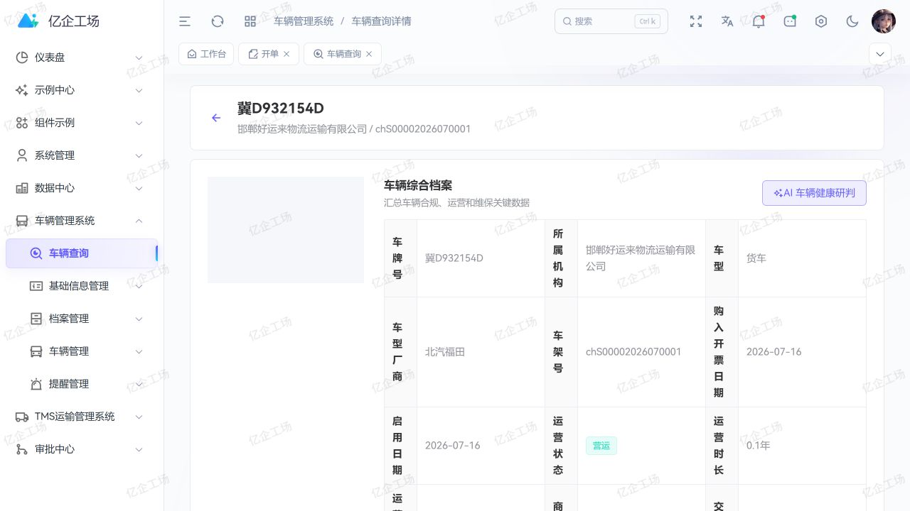

<div align="center">
  <h1>Art Supabase VMS</h1>
  <p><strong>围绕“一车一档”的车辆全生命周期管理应用</strong></p>
  <p>统一车辆档案、证照合规、维修保养、事故违章、零部件、里程与风险提醒。</p>

  <p>
    <a href="https://gitee.com/wangyanghub/art-supabase-vms">Gitee</a>
    ·
    <a href="https://github.com/869123771/art-supabase-vms">GitHub</a>
    ·
    <a href="https://gitee.com/wangyanghub/art-supabase-pro">主平台</a>
    ·
    <a href="https://869123771.github.io/art-supabase-doc/modules/vms">使用文档</a>
  </p>
</div>

## 项目定位

Art Supabase VMS 是 Art Supabase Pro 的车辆管理业务应用。它以车辆档案为主线，聚合司机、证照、保险、年检、维修、事故、违章、例检、里程、零部件与设备信息，支持从建档审核到退役提醒的连续治理。

本仓只维护 VMS 页面、业务 API、领域类型、车辆规则与专属 Edge Function。认证、租户、菜单、权限、布局、路由、公共组件、Store 和 Supabase 公共客户端由 [`art-supabase-pro`](https://gitee.com/wangyanghub/art-supabase-pro) 统一提供。



## 核心能力

| 领域       | 已覆盖能力                                           |
| ---------- | ---------------------------------------------------- |
| 档案与查询 | 车辆建档、编辑、审核、详情聚合、综合查询与状态管理   |
| 证照与合规 | 保险、年检、违章、事故、证照附件与到期治理           |
| 运行与维护 | 维修保养、日常例检、里程记录、车辆设备与历史追踪     |
| 零部件     | 配件分类、配件资料、供应商、领用安装、替换与寿命跟踪 |
| 风险提醒   | 保险、年检、保养、配件和车辆使用寿命提醒与处置工单   |
| 智能分析   | 车队健康概览、单车风险聚合与 AI 车辆健康建议         |

## 一车一档

```text
车辆基础档案
  ├─ 司机与归属
  ├─ 保险 / 年检 / 违章 / 事故
  ├─ 维修 / 例检 / 里程
  ├─ 配件 / 设备 / 附件
  └─ 到期提醒 / 风险工单 / 健康分析
```

AI 健康建议用于汇总现有档案、解释风险和辅助排查，不替代人工检查、法定检验或专业维修判断。

## 独立运行

环境要求：Node.js `>= 22.0.0`、pnpm `>= 11.9.0`。

```powershell
pnpm install
pnpm dev
```

默认访问 `http://localhost:3015`。

```powershell
pnpm check
pnpm build
pnpm preview
```

生产构建输出到 `docs/`，默认公共路径为 `/art-supabase-vms/`，可作为 Pages 发布目录。

## 与主仓协作

VMS 业务修改在本仓提交并推送，随后在主仓更新 `modules/art-supabase-vms` 子模块指针。数据库菜单继续使用稳定的 `/vms/...` 路由前缀；HR/TMS 数据通过租户隔离、字段最小化的安全 RPC 读取，本仓不直接导入其他业务仓源码。

## 安全原则

- 车辆档案新增、编辑、提交、审核和删除分别受精确按钮权限与服务端规则控制。
- 跨模块只读取用途所需的最小字段，业务写入仍由 VMS 自己的 API/provider 负责。
- 页面可见不代表后端授权，数据库 RLS 和 RPC 校验是最终安全边界。

## 许可证

本项目采用 [MulanPSL-2.0](LICENSE) 许可证。
